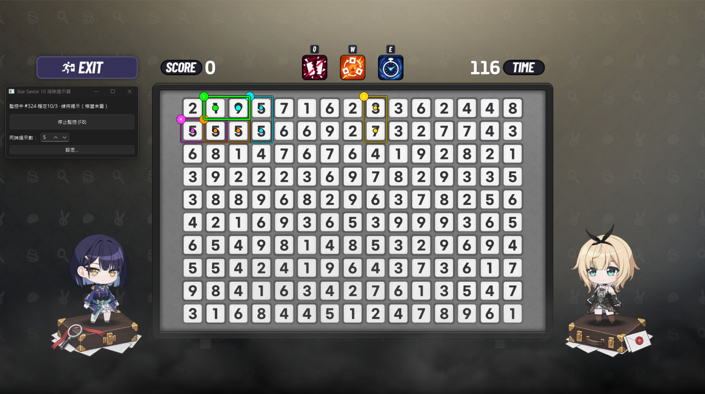
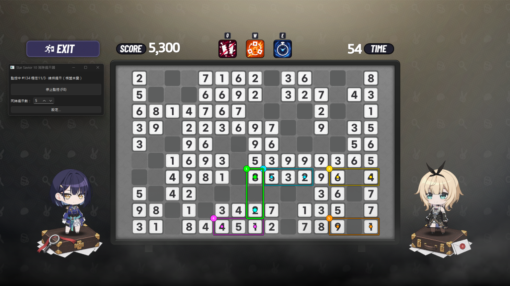
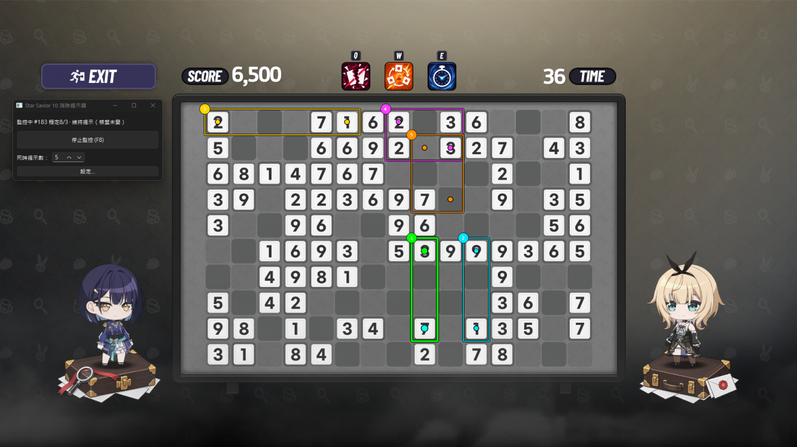

# Star Savior 10 消去ヘルパー


[繁體中文](README.md) | [English](README.en.md) | 日本語 | [한국어](README.ko.md)

「数字 10 消去ゲーム」の視覚アシストツール。**画面を解析してヒントを表示するだけで、ゲームには一切触りません**。マウス操作はすべてユーザーが行います。

## ダウンロード（Windows ポータブル版、インストール不要）

[**Releases**](../../releases) から `StarSaviorHelper.exe` をダウンロードしてダブルクリックで実行：
インストール不要。`settings.json` とログは exe の隣に残るので、exe を消せばクリーンに削除できます。

> **Windows 10 1803 以降 64-bit** が必要（バックグラウンド取得用。古い環境では自動でフォアグラウンドに退避するためゲームを見える状態に）。

## 操作イメージ

**序盤**：満盤時に上位 N 件のカラー＋番号ヒントを一括表示。緑の 1 番通りに打つだけ：



**中盤**：消去後の空白は跨いで有効。ヒントは新しい盤面に自動追従：



**終盤**：数字がまばらになっても正確に位置を指し示します：



## 特長

- **開いて準備、F8 で開始**：ゲームウィンドウを自動バインド＋盤面位置を記憶。移動／解像度変更でも選択し直し不要
- **連続自動検出**：画面変化 → 安定待ち → 再認識 → ヒント更新（消去アニメーションは自動スキップ）
- **カラー＋番号ヒント**：上位 N 件に異なる色＋番号バッジ。重なっても判別可能。同一数字群の重複枠は最小枠のみ残す
- **バックグラウンド取得**：他ウィンドウに覆われても動作。最小化で自動待機、ゲーム終了で自動停止
- **極簡メイン画面**：状態 1 行＋スイッチ 1 個＋ヒント数。その他は「設定…」に収納
- **4 言語 UI**：繁體中文／English／日本語／한국어。システム言語に追従（対象外は英語）、切替は即時反映

## 開発進捗

- [x] **Phase 1**：ROI 選択＋設定保存
- [x] **Phase 2**：10×15 Grid＋Cell State＋Template Matching（1～9 テンプレート完備）
- [x] **Phase 3**：Rectangle Solver（純粋アルゴリズム、BoardState のみ入力）
- [x] **Phase 4**：Hint Selector（最小 area＋固定走査順＋同一数字群の重複排除、上位 N 件）
- [x] **Phase 5**：透明クリックスルー Overlay（枠＋始点／終点＋番号バッジ）
- [x] **Phase 6**：画面変化検出（安定待ち＋Hint Lock＋安定後再認識）
- [x] **Phase 7**：結合テストと UX 修正（F8 グローバルホットキー含む）

## 使い方（目標：開いて準備、F8 で開始）

1. StarSavior ゲーム（タイトルが `StarSavior` のウィンドウ）を起動してから本ツールを開く
2. ゲームウィンドウを自動バインド＋盤面位置を検証。前回の選択があれば即「準備完了」
3. 初回のみ：メイン画面に「**盤面領域を選択して開始**」だけ表示 → live ゲーム画面上で 10 × 15 盤面をドラッグで囲む
   （**Enter またはダブルクリック＝確定**、**Esc＝キャンセル**。
   ウィンドウ相対比率で保存するため移動／解像度変更でも選択し直し不要）。確定すれば準備完了
4. 「**監視開始 (F8)**」で開始。`F8`＝監視の開始／停止（マスタースイッチ、ヒント処理のみ）
5. 「**ヒント数**」（1～10、既定 5）：上位 N 件のヒント群を一括表示。
   緑の 1 番が本命、2～N 番は各色＋番号バッジ。同一数字群の重複矩形は最小枠のみ残す
   （残りは空白余白で、消去結果は同じ）。設定は記憶
6. 普段触らないものはすべて「**設定…**」に：ROI 微調整／自動調整／プレビュー、盤面表示、常に手前、
   言語（繁中／English／日本語／한국어。既定はシステム言語、対象外は英語、切替は即時反映）

取得パイプライン：Windows バックグラウンド取得を優先（覆われても動作）、不可ならフォアグラウンドに退避。
最小化で「ゲームウィンドウ待ち」表示、ゲーム終了で自動停止。

## Phase 1 詳細（選択操作）

1. ガイドボタン（または設定内の「**盤面領域を選択**」）→ メイン画面が隠れ、全画面セレクタが出現
2. 左ボタンを押したままゲームの 10 × 15 数字盤面を**ドラッグ**で大まかに囲む（任意方向、X/Y/W/H を live 表示）
3. 放すと実盤面位置に**自動調整**され、10 × 15 グリッドで確認表示
   - 調整失敗時は元の選択をそのまま使用
   - `A` で自動調整のオン／オフ切替
4. **Enter またはダブルクリック＝確定**、**Esc＝キャンセル**、**再ドラッグ＝再選択**
5. 設定ダイアログの X／Y／Width／Height 欄で手動微調整も可。「**自動調整**」で live 画面から現 ROI を再調整
6. ROI はプロジェクト直下の `settings.json` に自動保存、次回起動時に読込
7. ゲームウィンドウが移動していれば起動時に新位置へ自動吸着して保存
   （まず旧位置付近を探索、次に全画面探索＋認識検証。すべて失敗時のみ旧設定を維持）
8. 設定ダイアログのプレビューで選択結果＋10 × 15 グリッドを確認し、調整を検証

## Phase 2／3

- 監視中の live 10×15 盤面は設定ダイアログで確認可能（読取専用）
- 数字テンプレートの再構築：`uv run python tools/build_templates.py <スクショ> <アノテーションJSON>`
  （アノテーション形式 `{"row,col": digit}`。ROI は既定で `settings.json` を読む）
- Solver は純粋関数 `core/solver.py::find_rectangles(board)`。
  単体テスト：`uv run pytest tests/test_solver.py`

## Phase 5

- 盤面が安定変化し UNKNOWN がなければ上位 N ヒントを自動計算して透明 Overlay に表示
  （1 番：緑枠＋緑始点＋青終点＝推奨ドラッグ始終マス中心。
  2～N 番：各色＋番号バッジ、一括全表示）
- Overlay はマウスを受けず、フォーカスも奪わない。監視停止（または F8）で非表示
- 取得前に Overlay を自動非表示にするため、枠線が認識を汚染しない

## Phase 6

- 「**監視開始**」（または F8）：300ms 毎に ROI フレームを比較。基準と異なる安定フレームが 3 連続したら再認識
  （アニメーション途中フレームはスキップ）。実盤面変化時のみ Overlay を更新
  （Hint Lock）、それ以外は現ヒントを維持
- 「**監視停止**」：ループ停止＋ヒント非表示。ROI 変更時は自動で先に停止
- 監視中の状態行に `#tick 安定 run/3` 進捗と最新イベントを表示
  （ヒント更新／維持／UNKNOWN 待ち）。詰まったらまずこの行を確認
- `debug/monitor.log` に安定トリガー毎の再認識結果と Overlay 残留リトライを記録。
  問題報告時はこのログを添付
- `F8`＝監視の開始／停止（マスタースイッチ、ヒント処理のみ、ゲームには不干渉）

## Phase 7 補足

- `tests/test_integration.py`：リポジトリ内実テンプレートで合成盤面を構築し、
  ROI 画面 → 認識 → Solver → Hint → Overlay ジオメトリまで end-to-end 検証、
  さらに盤面変化を跨ぐ monitor 全鎖も検証
- 変化検出は「変化画素比率」（全画面平均ではない）を使うため、1～2 マス消去
  （全 ROI の約 1%）でも発火。閾値は `core/monitor.py::MonitorConfig`

## よくある質問

- **「ウィンドウが見つからない」と出る**：先にゲームを起動してから開始。タイトルが `StarSavior` であること、最小化されていないことを確認。
- **開始してもヒントが更新されない**：状態行を確認。「ゲームウィンドウ待ち」は最小化中。「ヒント維持（盤面変化なし）」は本当に変化なし。詰まったらまず `debug/monitor.log`。
- **「?」（UNKNOWN）が多い**：大抵はエフェクト／アニメーションが数字を覆っているため。静止すれば自動で再認識。慢性的に続く場合はフォント変更の可能性。
- **選択枠がずれる**：放せば自動調整、失敗時は元の選択を使用。「設定…」の「自動調整」か、選択し直しで解決。
- **F8 が効かない**：他アプリに奪われている可能性。メイン画面のスイッチでも同じ操作が可能。

## Roadmap

大機能は完成済み。今後はバグ修正と小規模 UX 改善が中心。Issue 歓迎（`debug/monitor.log` 添付で特定が高速に）。

## 開発者向け

- Python 3.13＋[uv](https://docs.astral.sh/uv/)
- **開発テスト実行：`run.bat` をダブルクリック**（初回は依存関係を自動インストール。失敗時はメッセージ表示で一時停止）

コマンドラインの場合：

```powershell
uv sync
uv run python main.py
```

## テスト

```powershell
uv run pytest
```

## CodeGraph（保守用コード索引）

```powershell
codegraph sync    # 編集後に索引を同期（増分、高速）
codegraph index   # 索引破損時や大改修後に全再構築
```

- 索引は `.codegraph/`（SQLite）、ローカルのみ、git 対象外。新規 clone 後は `codegraph init` を 1 回
- 日常のコード質問は MCP `codegraph_explore` へ：関連シンボル原文＋呼出鎖を一発取得、grep＋Read 周回不要

## アーキテクチャ

```
main.py                     # エントリ（DPI awareness＋QApplication）
core/
    roi_model.py            # Roi（絶対）＋RoiFrac（ウィンドウ相対比率）＋IoU
    settings_store.py       # 設定 JSON：ウィンドウタイトル／roi_frac／ui 設定（旧 roi は自動移行）
    game_window.py          # 対象ウィンドウ束縛（完全一致タイトル＋可視＋最大）とクライアント領域
    window_capture.py       # WGC バックグラウンド取得セッション＋単発取得（覆われても動作）
    screen_capture.py       # mss フォアグラウンド取得（退避用。選択背景、絶対座標 ROI）
    board_align.py          # 10×15 盤面自動調整（ROI Auto-Align）
    grid.py                 # ROI を 10×15 固定分割（CellGeometry は center 付き）
    board_state.py          # BoardState＋CellState（DIGIT／EMPTY／UNKNOWN 三態分離）
    templates.py            # TemplateStore：1～9 テンプレート読書（照合はしない）
    recognition.py          # DigitRecognizer：白タイル不在 → EMPTY、他はテンプレート照合
    board_builder.py        # ROI 画面 → 分割 → 認識 → BoardState
    solver.py               # Rectangle Solver：純粋アルゴリズム、BoardState → 全合法矩形
    hint_selector.py        # Hint Selector：最小 area＋固定順＋同一数字群の重複排除、上位 N 件
    monitor.py              # フレーム安定追跡＋Hint Lock（GUI／取得に不干渉）
    paths.py                # frozen パス互換（リソースは展開 temp、可書込は exe 隣）
    i18n.py                 # UI 文字列 zh／en／ja／ko＋システム言語検出
gui/
    main_window.py          # メイン画面（状態 1 行＋監視スイッチ＋ヒント数＋初回ガイド）
    settings_dialog.py      # 設定ダイアログ（ROI 選択／微調整／プレビュー、盤面表示、手前表示、言語）
    roi_selector.py         # 全画面セレクタ（自動調整付き。背景はバックグラウンドフレーム可）
    recognition_panel.py    # 10×15 認識結果表示
    hint_overlay.py         # 透明クリックスルー Overlay（10 色枠＋始終点＋番号バッジ、マウス不干渉）
    global_hotkey.py        # F8 グローバルホットキー（Win32 RegisterHotKey、監視マスタースイッチ）
    image_utils.py          # QImage ↔ numpy 変換
docs/
    adr/                    # アーキテクチャ決定記録（バックグラウンド取得、相対 ROI…）
CONTEXT.md                  # プロジェクト用語集（正規用語＋禁止語、繁体中文）
templates/
    1.png ... 9.png         # 実ゲーム画面から取得した数字テンプレート（tools/build_templates.py で作成）
tools/
    build_templates.py      # スクショ＋标注 JSON からテンプレート作成／更新
tests/                      # pytest 単体テスト（solver と brute-force 参照実装の突合せ含む）
```

### 座標系

パイプライン全程で**物理スクリーン画素**を使用：`main.py` で Per-Monitor DPI awareness を設定し Qt High-DPI スケーリングを無効化（`QT_ENABLE_HIGHDPI_SCALING=0`）するため、Qt 座標と取得座標が一致し、Overlay も同一座標系。設定ファイルには**ウィンドウ相対比率**（`roi_frac`）を保存し、起動時と毎 tick に live ゲームクライアント領域から絶対座標へ換算するため、移動／解像度変更でも選択し直し不要。

## 免責事項

本ツールはゲーム画面の読取とヒント表示のみを行い、ゲームの改変やマウス／キーボード操作の送信は一切行いません。ゲームの利用規約を遵守し、自己責任で使用してください（MIT License、無保証）。
